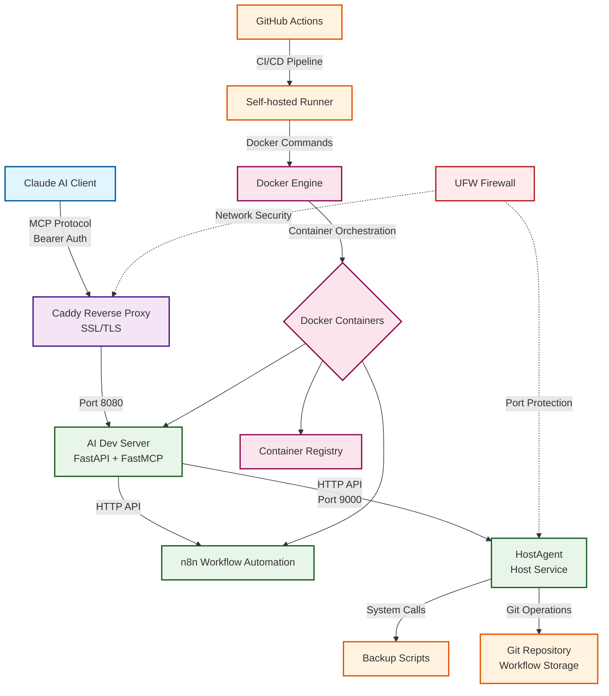

# VPS Infrastructure

Modern, secure VPS infrastructure with containerized services and AI integration capabilities.

# VPS Architecture Diagram



logies

1. **Docker** - Container runtime and orchestration
   - Manages all containerized services
   - Provides network isolation and service discovery
   - Enables consistent deployments

2. **FastAPI** - Modern Python web framework
   - Powers the AI Dev Server
   - Provides REST API endpoints
   - Automatic OpenAPI documentation

3. **FastMCP** - Model Context Protocol implementation
   - Enables AI agent integrations
   - Provides tool interface for Claude AI
   - Session management for stateful interactions

4. **Claude AI** - AI assistant platform
   - Connects via MCP protocol
   - Executes tools and workflows
   - Provides intelligent automation

5. **n8n** - Workflow automation platform
   - Visual workflow builder
   - API-driven automation
   - Integration with multiple services

6. **GitHub Actions** - CI/CD automation
   - Automated deployments on push
   - Self-hosted runner on VPS
   - Docker image building and registry push

7. **Caddy** - Web server and reverse proxy
   - Automatic HTTPS with Let's Encrypt
   - Request routing to services
   - Security headers and compression

8. **UFW** - Uncomplicated Firewall
   - Network security enforcement
   - Port access control
   - Service isolation

### Communication Flow

1. **Client → Caddy**: HTTPS requests with Bearer authentication
2. **Caddy → AI Dev Server**: Reverse proxy to localhost port 8080
3. **AI Dev Server → n8n**: HTTP API calls for workflow management
4. **AI Dev Server → HostAgent**: HTTP API calls for host operations
5. **HostAgent → System**: Direct system calls for backups and git operations
6. **GitHub Actions → Docker**: Automated deployment pipeline
7. **Docker → Services**: Container orchestration and networking

## Architecture Overview

This VPS setup provides a development and production environment with the following services:

### Core Services

- **AI Dev Server** - FastMCP + FastAPI server for AI integrations and n8n workflow management
- **HostAgent** - Secure local API for privileged host operations (backups, system tasks)
- **n8n** - Workflow automation platform with AI capabilities
- **Supabase** - Complete backend with PostgreSQL, Auth, Storage, and Edge Functions
- **Browserless** - Headless Chrome service for web automation
- **DBT** - Data transformation and analytics
- **Container Registry** - Private Docker registry for custom images
- **DTC App** - Custom frontend application
- **GitHub Actions Runner** - Self-hosted runner for automated deployments

### Service Communication

```
┌─────────────────┐    ┌──────────────────┐    ┌─────────────────┐
│   AI Dev Server │◄──►│    HostAgent     │◄──►│   Backup Scripts│
│  (Container)    │    │   (Host Service) │    │    (Host)       │
└─────────────────┘    └──────────────────┘    └─────────────────┘
         │                       │
         ▼                       ▼
┌─────────────────┐    ┌──────────────────┐
│      n8n        │    │    Git Repo      │
│  (Container)    │    │  (Workflows)     │
└─────────────────┘    └──────────────────┘
         │
         ▼
┌─────────────────┐
│   Supabase      │
│ (Multi-container│
│    Stack)       │
└─────────────────┘
```

## Docker Networking

### Network Architecture

All services are connected via Docker networks with specific networking requirements:

- **Supabase Network**: Primary network (`supabase_default`) that most services join
- **Host Access**: Services needing host access use `extra_hosts: "host.docker.internal:host-gateway"`
- **Port Binding**: Services bind to `127.0.0.1` for security (localhost only)

### Critical Networking Configuration

#### HostAgent ↔ AI Dev Server Communication

The AI Dev Server (containerized) needs to communicate with HostAgent (host service):

1. **AI Dev Server** uses `host.docker.internal:9000` to reach HostAgent
2. **HostAgent** must bind to `0.0.0.0:9000` (not `127.0.0.1`) to accept container connections
3. **Security**: HostAgent port 9000 is not exposed externally (firewall/port binding)

**Configuration:**

```yaml
# docker-compose/ai-dev-server/docker-compose.yml
services:
  ai-dev-server:
    extra_hosts:
      - "host.docker.internal:host-gateway"  # Enable host access
```

```bash
# host-agent/.env
HOST=0.0.0.0  # Allow container access
PORT=9000
```

#### Service Discovery

Services discover each other using:
- **Container names** as hostnames within networks
- **Localhost ports** for external access
- **Internal networking** for inter-container communication

### Network Security

- **Firewall**: UFW configured to block external access to service ports
- **Localhost binding**: Services bind to `127.0.0.1` preventing external access
- **Container isolation**: Services run in isolated Docker networks
- **Authentication**: All services require proper authentication tokens

## Quick Start

### Prerequisites

- Docker and Docker Compose
- UFW firewall configured
- Domain with DNS pointing to server
- SSL certificates (via Caddy)

### Deployment

```bash
# Clone repository
git clone <repository-url> /home/david/vps
cd /home/david/vps

# Configure environment variables
cp host-agent/.env.example host-agent/.env
# Edit .env files with your configuration

# Deploy HostAgent service (primary deployment method)
./deploy.sh

# Deploy individual Docker services
cd docker-compose/[service-name]
docker-compose up -d

# Set up GitHub Actions runner for automated deployments
cd github-runner
./setup-runner.sh
# Configure with GitHub token from repo settings
./start-runner-service.sh

# Verify deployment
docker ps
sudo systemctl status host-agent
sudo systemctl status actions.runner.*
```

### Service Access

- **Supabase API**: https://supabase.correlion.ai
- **Supabase Studio**: http://localhost:3000 (SSH tunnel required)
- **n8n**: https://n8n.correlion.ai
- **AI Dev Server**: https://ai-dev.correlion.ai/llm/mcp/
- **Container Registry**: https://registry.correlion.ai
- **DTC App**: https://dtc.correlion.ai
- **Airflow**: https://airflow.correlion.ai

## Service Management

### Starting/Stopping Services

```bash
# Individual Docker services
cd docker-compose/[service-name]
docker-compose up -d
docker-compose down

# HostAgent (systemd service)
sudo systemctl start/stop/restart host-agent
sudo journalctl -u host-agent -f

# GitHub Actions Runner
sudo systemctl start/stop/restart actions.runner.*
sudo journalctl -u actions.runner.* -f

# Deploy script (for HostAgent updates)
./deploy.sh
```

### Automated Deployments

GitHub Actions automatically deploys services when changes are pushed:

- **AI Dev Server**: Push changes to `ai-dev-server/` → Auto-builds and deploys
- **Workflow**: `.github/workflows/deploy-ai-dev-server.yml` defines deployment
- **Runner**: Self-hosted runner on VPS executes deployments
- **Registry**: Images pushed to `registry.correlion.ai`

### Container Names

All services use clean, predictable container names:
- `ai-dev-server`
- `n8n` 
- `supabase-*` (multiple containers)
- `browserless-chromium`
- `registry`
- `dbt`
- `dtc-frontend-app`

### Health Checks

```bash
# Service health endpoints
curl http://127.0.0.1:8080/health    # AI Dev Server
curl http://127.0.0.1:9000/health    # HostAgent
curl http://127.0.0.1:3000/api/platform/profile  # Supabase Studio

# Container status
docker ps
docker logs -f [container-name]
```

## Environment Configuration

### Required Environment Variables

Each service requires specific environment variables. Key shared variables:

```bash
# Shared authentication
MCP_BEARER_TOKEN=your-secure-token
HOST_AGENT_BEARER_TOKEN=your-secure-token

# n8n Configuration  
N8N_BASE_URL=http://n8n:5678
N8N_API_KEY=your-n8n-api-key

# Database (Supabase)
POSTGRES_PASSWORD=your-db-password
JWT_SECRET=your-jwt-secret
ANON_KEY=your-anon-key
SERVICE_ROLE_KEY=your-service-role-key
```

### Security Best Practices

- **Random tokens**: Generate secure random tokens for all services
- **Unique passwords**: Use different passwords for each service
- **Environment files**: Never commit `.env` files to version control
- **Regular rotation**: Rotate secrets periodically
- **Least privilege**: Services run with minimal required permissions

## Backup and Disaster Recovery

### Automated Backups

- **n8n Workflows**: Automated backup via `backup-n8n-workflows.sh` script or HostAgent API
- **Database**: Supabase handles automatic backups
- **Container Registry**: Images stored with versioning
- **Configuration**: All configuration in Git (except secrets)

### Manual Backup Commands

```bash
# n8n workflows backup (via script)
./backup-n8n-workflows.sh

# n8n workflows backup (via HostAgent API)
curl -X POST http://127.0.0.1:9000/backup/n8n \
  -H "Authorization: Bearer $HOST_AGENT_BEARER_TOKEN"

# Database backup
docker exec supabase-db pg_dump -U postgres database_name > backup.sql

# Full system state
docker images > docker-images.txt
docker ps -a > docker-containers.txt
```

## Development

### Local Development

Each service has its own development setup. See individual service READMEs:

- [AI Dev Server](ai-dev-server/README.md) - FastMCP development and testing
- [HostAgent](host-agent/README.md) - Local API development
- [DBT](docker-compose/dbt/README.md) - Data transformation development
- [GitHub Runner](github-runner/README.md) - Automated deployment setup

### Adding New Services

1. Create service directory in `docker-compose/`
2. Add `docker-compose.yml` with proper networking
3. Update this README with service description
4. Add to deployment scripts if needed
5. Configure Caddy reverse proxy if external access needed
6. Create GitHub workflow in `.github/workflows/` for automated deployment

### Testing

```bash
# Test inter-service communication
docker exec ai-dev-server curl http://host.docker.internal:9000/health
docker exec ai-dev-server curl http://n8n:5678/healthz

# Test external access
curl https://[domain].correlion.ai/health
```

## Troubleshooting

### Common Issues

**HostAgent Connection Refused**
- Check `HOST=0.0.0.0` in host-agent `.env`
- Verify HostAgent service is running: `sudo systemctl status host-agent`
- Test connectivity: `docker exec ai-dev-server curl http://host.docker.internal:9000/health`

**Container Networking Issues**
- Verify containers are on correct network: `docker network ls`
- Check container names match docker-compose configuration
- Ensure `extra_hosts` configured for host access

**Service Discovery Failures**
- Use container names as hostnames
- Check network configuration in docker-compose files
- Verify services are running: `docker ps`

### Monitoring

```bash
# Service logs
sudo journalctl -u host-agent -f
docker logs -f ai-dev-server
docker logs -f n8n

# System resources
docker stats
df -h
free -m

# Network connectivity
docker exec [container-name] ping [other-container]
docker exec [container-name] nslookup [service-name]
```

## Contributing

1. Follow service-specific development guides
2. Update READMEs for any networking changes
3. Test deployment with appropriate scripts
4. Verify all services communicate correctly
5. Update environment variable documentation

## License

This project contains configuration and deployment scripts for VPS infrastructure management.