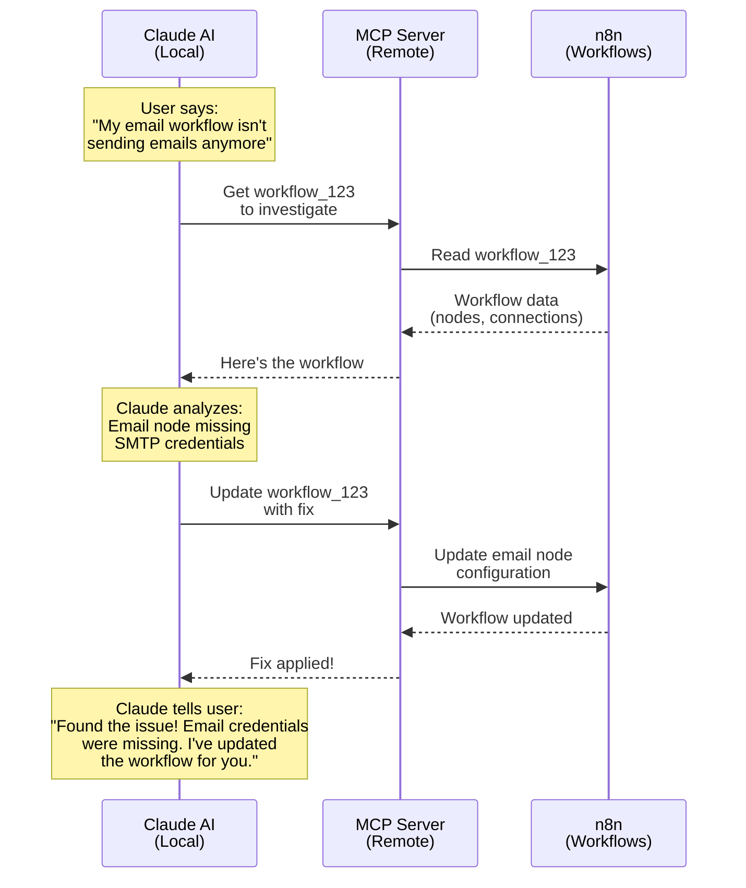
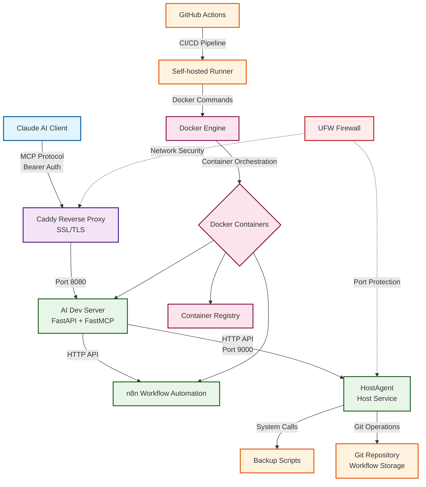

# AI Dev Server

Combined FastAPI + FastMCP server providing AI integrations and n8n workflow management capabilities.

## Overview

AI Dev Server integrates FastAPI and FastMCP to provide:
- Web API endpoints for health checks and service information
- MCP (Model Context Protocol) tools for AI agent integrations
- n8n workflow management capabilities
- Multi-Agent capabilities are planned

## How Claude AI Controls n8n Through MCP

### Example: Debugging a Workflow



### What's Happening?

1. **You report a problem** - You tell Claude your workflow isn't working
2. **Claude investigates** - Uses MCP tools to read the workflow configuration
3. **Claude analyzes** - Identifies the issue (missing email credentials)
4. **Claude fixes it** - Updates the workflow with the correct configuration
5. **Claude confirms** - Tells you what was wrong and that it's now fixed

### Key Concepts

- **Claude AI** - The AI assistant running on your computer
- **MCP (Model Context Protocol)** - A bridge that lets Claude use external tools
- **MCP Server** - A remote server (this AI Dev Server) that has tools Claude can use
- **n8n** - The workflow automation platform you want to control

Think of it like this: Claude is your assistant, MCP is the phone line, and n8n is the service you're calling. Claude doesn't directly access n8n - it goes through MCP which acts as a secure middleman.

## System Architecture

### VPS Infrastructure Overview



### VPS Technology Stack

#### Core Technologies

1. **Docker** - Container runtime and orchestration
   - Manages all containerized services
   - Provides network isolation and service discovery
   - Enables consistent deployments

2. **FastAPI** - Modern Python web framework
   - Powers the AI Dev Server
   - Provides REST API endpoints
   - Automatic OpenAPI documentation

3. **FastMCP** - Model Context Protocol implementation
   - Enables AI agent integrations
   - Provides tool interface for Claude AI
   - Session management for stateful interactions

4. **Claude AI** - AI assistant platform
   - Connects via MCP protocol
   - Executes tools and workflows
   - Provides intelligent automation

5. **n8n** - Workflow automation platform
   - Visual workflow builder
   - API-driven automation
   - Integration with multiple services

6. **GitHub Actions** - CI/CD automation
   - Automated deployments on push
   - Self-hosted runner on VPS
   - Docker image building and registry push

7. **Caddy** - Web server and reverse proxy
   - Automatic HTTPS with Let's Encrypt
   - Request routing to services
   - Security headers and compression

8. **UFW** - Uncomplicated Firewall
   - Network security enforcement
   - Port access control
   - Service isolation

### Communication Flow

1. **Client → Caddy**: HTTPS requests with Bearer authentication
2. **Caddy → AI Dev Server**: Reverse proxy to localhost port 8080
3. **AI Dev Server → n8n**: HTTP API calls for workflow management
4. **AI Dev Server → HostAgent**: HTTP API calls for host operations
5. **HostAgent → System**: Direct system calls for backups and git operations
6. **GitHub Actions → Docker**: Automated deployment pipeline
7. **Docker → Services**: Container orchestration and networking


## Tech Stack

- **Python 3.11+** - Runtime environment
- **FastMCP 2.10.6+** - MCP protocol implementation
- **FastAPI 0.115.0+** - Web framework with OpenAPI docs
- **uvicorn** - ASGI server
- **httpx** - Async HTTP client for API calls
- **uv** - Fast Python package manager

## API Endpoints

### FastAPI Endpoints

- `GET /` - Service information
- `GET /health` - Health check for load balancers
- `GET /ready` - Readiness check
- `POST /auth` - Development authentication endpoint
- `GET /docs` - OpenAPI documentation

### MCP Endpoint

- `/llm/mcp/` - MCP protocol endpoint (requires authentication)

## MCP Tools

The server provides the following MCP tools:

### Basic Tools
- `echo` - Echoes back the provided message
- `get_status` - Returns server status information

### n8n Workflow Management Tools
- `n8n_list_workflows` - List all n8n workflows
- `n8n_get_workflow` - Get specific workflow by ID
- `n8n_create_workflow_json` - Create new workflow using JSON
- `n8n_update_workflow_json` - Update existing workflow using JSON
- `n8n_delete_workflow` - Delete workflow by ID
- `n8n_activate_workflow` - Activate workflow for execution
- `n8n_deactivate_workflow` - Deactivate workflow
- `n8n_backup_workflows` - Backup workflows to git via HostAgent

## Environment Variables

Required environment variables:

```bash
# Authentication
MCP_BEARER_TOKEN=your-secure-token        # Required for MCP authentication

# n8n Configuration
N8N_BASE_URL=http://n8n:5678             # n8n API endpoint (default: http://localhost:5678)
N8N_API_KEY=your-n8n-api-key            # n8n API key for authentication

# HostAgent Integration
HOST_AGENT_BEARER_TOKEN=your-token       # Bearer token for HostAgent API calls
```

## Quick Start

### Local Development

```bash
# Install dependencies
uv sync

# Set environment variables
export MCP_BEARER_TOKEN="your-secure-token"
export N8N_BASE_URL="http://localhost:5678"
export N8N_API_KEY="your-n8n-api-key"
export HOST_AGENT_BEARER_TOKEN="your-host-agent-token"

# Run server
uv run server.py

# Or run in background
nohup uv run server.py > server.log 2>&1 & echo $!

# Kill server
pkill -f server.py

# Test endpoints
curl http://127.0.0.1:8080/health
curl http://127.0.0.1:8080/docs
```

### Docker Deployment

```bash
# Build image
docker build -t ai-dev-server .

# Run container
docker run -d \
  --name ai-dev-server \
  -p 127.0.0.1:8080:8080 \
  -e MCP_BEARER_TOKEN="your-token" \
  -e N8N_BASE_URL="http://n8n:5678" \
  -e N8N_API_KEY="your-n8n-api-key" \
  -e HOST_AGENT_BEARER_TOKEN="your-host-agent-token" \
  --add-host host.docker.internal:host-gateway \
  ai-dev-server
```

## Production Deployment

### Docker Compose Configuration

```yaml
services:
  ai-dev-server:
    image: registry.correlion.ai/ai-dev-server:latest
    container_name: ai-dev-server
    ports:
      - "127.0.0.1:8080:8080"
    volumes:
      - /home/david/scripts:/scripts
      - /var/run/docker.sock:/var/run/docker.sock
      - /home/david/n8n-workflows-backup:/home/david/n8n-workflows-backup
    environment:
      - PYTHONUNBUFFERED=1
      - MCP_BEARER_TOKEN=${MCP_BEARER_TOKEN}
      - N8N_BASE_URL=${N8N_BASE_URL}
      - N8N_API_KEY=${N8N_API_KEY}
      - HOST_AGENT_BEARER_TOKEN=${HOST_AGENT_BEARER_TOKEN}
    extra_hosts:
      - "host.docker.internal:host-gateway"
    healthcheck:
      test: ["CMD", "curl", "-f", "http://localhost:8080/health"]
      interval: 30s
      timeout: 10s
      retries: 3
      start_period: 10s
    restart: unless-stopped
    networks:
      - supabase
```

### Caddy Configuration

```caddyfile
ai-dev.correlion.ai {
    encode gzip zstd
    
    reverse_proxy localhost:8080
    
    header {
        Strict-Transport-Security "max-age=31536000;"
        X-XSS-Protection "1; mode=block"
        X-Content-Type-Options "nosniff"
        X-Frame-Options "DENY"
        Referrer-Policy "strict-origin-when-cross-origin"
    }
}
```

## Authentication

The server uses Bearer token authentication for MCP endpoints:

1. All requests to `/llm/*` paths require an `Authorization` header
2. Accepted formats:
   - `Authorization: Bearer <token>` - Direct bearer token
   - `Authorization: Basic <credentials>` - Basic auth passthrough from Caddy

### Adding to Claude Code

```bash
# With bearer token
claude mcp add --transport http ai-dev-server https://ai-dev.correlion.ai/llm/mcp/ \
  --header "Authorization: Bearer $MCP_BEARER_TOKEN"
```

## MCP Protocol Details

### Session Management

The server uses MCP's streamable HTTP transport which requires:
1. Initial session creation via `initialize` method
2. Session ID returned in response headers
3. Subsequent requests must include `mcp-session-id` header

### Required Headers

- `Content-Type: application/json`
- `Accept: application/json, text/event-stream`
- `Authorization: Bearer <token>`
- `mcp-session-id: <session-id>` (after initialization)

### Manual Testing

```bash
# 1. Initialize session
curl -X POST https://ai-dev.correlion.ai/llm/mcp/ \
  -H "Content-Type: application/json" \
  -H "Accept: application/json, text/event-stream" \
  -H "Authorization: Bearer $MCP_BEARER_TOKEN" \
  -d '{"jsonrpc": "2.0", "id": 1, "method": "initialize", "params": {"protocolVersion": "2024-11-05", "capabilities": {}, "clientInfo": {"name": "test-client", "version": "1.0.0"}}}'

# 2. List tools (use session ID from step 1)
curl -X POST https://ai-dev.correlion.ai/llm/mcp/ \
  -H "Content-Type: application/json" \
  -H "Authorization: Bearer $MCP_BEARER_TOKEN" \
  -H "mcp-session-id: <session-id>" \
  -d '{"jsonrpc": "2.0", "id": 2, "method": "tools/list", "params": {}}'
```

## Docker Networking

### Host Service Communication

- Uses `host.docker.internal:9000` to reach HostAgent
- Requires `extra_hosts: ["host.docker.internal:host-gateway"]` in Docker
- HostAgent must bind to `0.0.0.0:9000` to accept container connections

### Network Configuration

- Joins the `supabase_default` network for service discovery
- Can communicate with n8n container using hostname `n8n`
- Binds to localhost only (`127.0.0.1:8080`) for security

## Troubleshooting

### Common Issues

**Connection to HostAgent fails**
- Verify HostAgent is running: `sudo systemctl status host-agent`
- Check HostAgent is binding to `0.0.0.0:9000`
- Ensure `HOST_AGENT_BEARER_TOKEN` is set correctly

**n8n API errors**
- Verify n8n container is running: `docker ps | grep n8n`
- Check `N8N_API_KEY` is correct
- Ensure container can reach n8n at `http://n8n:5678`

**Authentication failures**
- Verify `MCP_BEARER_TOKEN` environment variable is set
- Check Authorization header format is correct
- Ensure token matches in request and server environment

### Logs

```bash
# View container logs
docker logs -f ai-dev-server

# View local server logs
tail -f server.log
```

## Development

### Adding New MCP Tools

1. Define tool function with `@mcp.tool` decorator
2. Add proper type hints and docstring
3. Return JSON-serializable data
4. Test with Claude Code or manual API calls

### Building Docker Image

```bash
# Build locally
docker build -t ai-dev-server .

# Tag for registry
docker tag ai-dev-server registry.correlion.ai/ai-dev-server:latest

# Push to registry
docker push registry.correlion.ai/ai-dev-server:latest
```