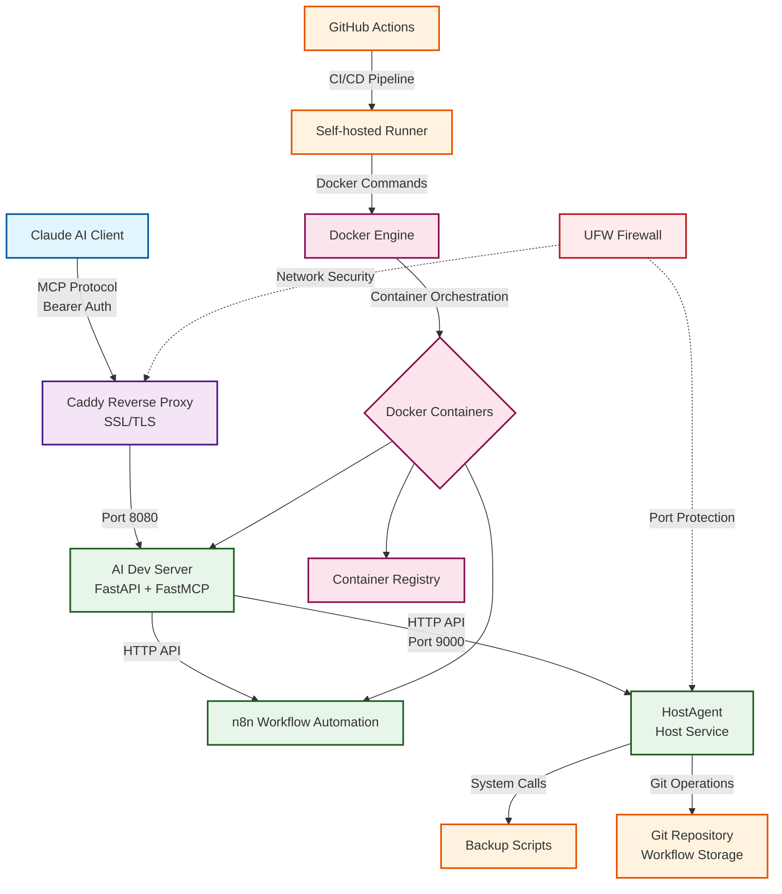

# VPS Architecture Diagram

## Technology Stack Overview

### Core Technologies

1. **Docker** - Container runtime and orchestration
   - Manages all containerized services
   - Provides network isolation and service discovery
   - Enables consistent deployments

2. **FastAPI** - Modern Python web framework
   - Powers the AI Dev Server
   - Provides REST API endpoints
   - Automatic OpenAPI documentation

3. **FastMCP** - Model Context Protocol implementation
   - Enables AI agent integrations
   - Provides tool interface for Claude AI
   - Session management for stateful interactions

4. **Claude AI** - AI assistant platform
   - Connects via MCP protocol
   - Executes tools and workflows
   - Provides intelligent automation

5. **n8n** - Workflow automation platform
   - Visual workflow builder
   - API-driven automation
   - Integration with multiple services

6. **GitHub Actions** - CI/CD automation
   - Automated deployments on push
   - Self-hosted runner on VPS
   - Docker image building and registry push

7. **Caddy** - Web server and reverse proxy
   - Automatic HTTPS with Let's Encrypt
   - Request routing to services
   - Security headers and compression

8. **UFW** - Uncomplicated Firewall
   - Network security enforcement
   - Port access control
   - Service isolation

### Communication Flow

1. **Client → Caddy**: HTTPS requests with Bearer authentication
2. **Caddy → AI Dev Server**: Reverse proxy to localhost port 8080
3. **AI Dev Server → n8n**: HTTP API calls for workflow management
4. **AI Dev Server → HostAgent**: HTTP API calls for host operations
5. **HostAgent → System**: Direct system calls for backups and git operations
6. **GitHub Actions → Docker**: Automated deployment pipeline
7. **Docker → Services**: Container orchestration and networking